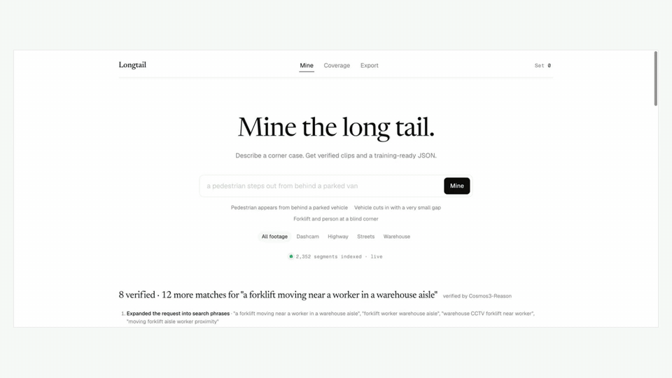
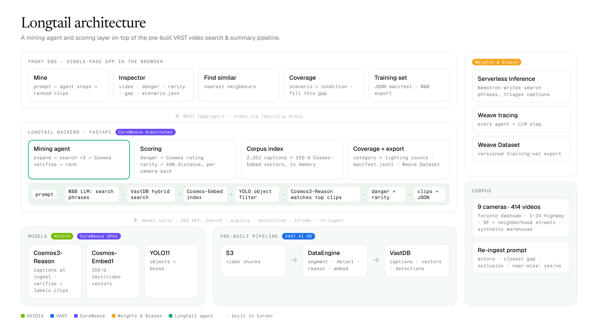

# Longtail



**Full 2-minute narrated demo:**


https://github.com/user-attachments/assets/67a82285-c8f9-4fd4-b763-5ba3f5f596a8


**Self-driving and robotics models fail on the rare moments they've never seen. Longtail finds those moments in footage nobody has watched.**

Describe a corner case in plain English ("a pedestrian steps out from behind a parked van"). Longtail's agent searches every indexed camera, has NVIDIA Cosmos watch the best candidates to verify them, ranks what's left by **danger × rarity**, and hands back playable clips plus a training-ready JSON manifest with clip IDs and start/end times.

Built for the VAST Builders Challenge (San Francisco, Oct 2 2026) on team-21's pre-indexed corpus: Toronto dashcam drives, I-24 highway cameras, SF and neighborhood street cameras, and a synthetic NVIDIA warehouse. That's 2,352 five-second segments from 414 videos.

- **Live app:** http://video-lab-team-21.cosmos.vastdata.com/app/ (reachable from inside the workshop network; see the demo video otherwise)
- **Demo video:** [demo/Longtail_explainer.mp4](demo/Longtail_explainer.mp4) (2 min, 1080p) · [play / download](https://github.com/ananya-mh/Longtail/raw/main/demo/Longtail_explainer.mp4)

## What it does

| View | What you get |
|---|---|
| **Mine** | Type a corner case → the agent's steps → verified clips ranked by danger × rarity → **Download JSON** |
| **Inspector** | Click a clip: video, danger / rarity / closest gap, why it's an edge case, and `scenario.json` written by Cosmos3-Reason after watching the clip |
| **Find similar** | Nearest neighbours of a clip in Cosmos-Embed1 space, one per source video |
| **Coverage** | Clip counts per scenario × condition (day, dusk, night, indoor). Click a thin cell and the agent mines that gap |
| **Training set** | Clips you kept → `manifest.jsonl`, or **Export to W&B** as a versioned Weave Dataset |
| **Live watch** | New segments landing from a re-ingest are screened automatically and flagged if they look like edge cases |

## How it works



```
                     ┌───────────── pre-built, already running (VAST + CoreWeave) ─────────────┐
 S3 video chunks ──► │ DataEngine: segment (5 s) → YOLO11 → Cosmos3-Reason caption → Cosmos-Embed1 │ ──► VastDB
                     └──────────────────────────────────────────────────────────────────────────┘
                                                                                             │
 Longtail (FastAPI on the team K8s cluster, /app)                                            │
   startup  : load every segment + caption (VSS /videos/explore) ◄──────────────────────────┘
              embed captions with Cosmos-Embed1 → rarity = kNN distance percentile, per camera pack
   mine     : prompt → W&B Inference LLM writes 3 search phrases → VSS hybrid search
              → best 8 candidates → Cosmos3-Reason watches each clip → keep danger ≥ 0.5 or near-miss
              → rank by 0.55·danger + 0.45·rarity → clips + JSON manifest
   inspect  : Cosmos3-Reason scenario.json  +  YOLO11 boxes → closest person-to-vehicle gap
   export   : manifest.jsonl, or W&B Weave Dataset (versioned)
   tracing  : every LLM / agent step traced in W&B Weave
```

**Re-ingest prompt.** Cosmos only writes down what its prompt asks about, so we re-ingested a slice of the dashcam and warehouse footage with [`reingest_prompt.txt`](reingest_prompt.txt). It asks for actors, closest person–vehicle distance, occlusions, cut-ins, reversing, lighting, and an explicit `Near-miss: yes/no` line.

**Scores.**
- **Danger (0–1):** Cosmos3-Reason's rating after watching the clip. Before a clip is opened, a quick text rating of its caption from the W&B LLM.
- **Rarity (0–1):** percentile of the mean cosine distance to the 10 nearest neighbours, computed **within the same camera pack**, so a warehouse clip isn't "rare" just for being in a warehouse.

## Sponsor stack

| Sponsor | Used for |
|---|---|
| **VAST Data** | AI OS: S3 segments, DataEngine ingest + re-ingest, VastDB hybrid search, VSS backend APIs |
| **NVIDIA** | Cosmos3-Reason (verification + scenario.json), Cosmos-Embed1 (rarity, find similar), YOLO11 (person–vehicle gap); Nemotron as the agent LLM |
| **CoreWeave** | GPUs serving the NVIDIA models; Kubernetes cluster hosting the app |
| **Weights & Biases** | Serverless Inference (agent search phrases, caption triage), Weave tracing, training-set export as a Weave Dataset |
| **Cursor** | Development on the workshop VM with the challenge skills |

## Inputs and outputs

**Input:** a natural-language corner case, plus an optional footage filter (`dashcam`, `highway`, `streets`, `warehouse`).

**Output:** the mining manifest returned by `POST /api/mine` and downloaded from the UI:

```json
{
  "query": "a pedestrian steps out from behind a parked vehicle",
  "search_phrases": ["...", "...", "..."],
  "verified_by": "nvidia/cosmos3-nano-reasoner",
  "clip_count": 6,
  "clips": [
    {
      "clip_id": "20261001_..._segment_003_of_006",
      "source": "s3://team-21-vss-chunks-segments/segments/..._segment_003_of_006.mp4",
      "original_video": "s3://team-21-vss-chunks/team-21/....mp4",
      "camera_id": "pie_cam-3",
      "domain": "driving",
      "start_sec": 10.0,
      "end_sec": 15.0,
      "title": "Pedestrian steps out from behind a parked van",
      "danger": 0.91,
      "rarity": 0.84,
      "cosmos_said": "…caption written at ingest…",
      "why_it_matters": "…one sentence…",
      "scenario": {"actors": ["pedestrian", "van"], "maneuver": "…", "closest_gap": "under 2 m",
                   "occlusion": true, "lighting": "day", "near_miss": true}
    }
  ]
}
```

`start_sec` / `end_sec` are offsets inside `original_video`; `source` is the 5-second segment itself.

**API** (all under `/app/`): `GET /api/status` · `POST /api/mine {prompt, domain}` · `GET /api/top` · `GET /api/similar?source=` · `GET /api/analyze?source=` · `GET /api/coverage` · `POST /api/fill-gap {category, condition}` · `POST /api/export {sources}` · `POST /api/export/wandb {sources}` · `GET /api/clip?source=` (video proxy).

## Run it

On the workshop VM (credentials come from `/config/<team>.config`):

```bash
git clone https://github.com/ananya-mh/Longtail && cd Longtail
python3 tools/probe.py                       # optional: check the backend and GPU models
python3 tools/reingest.py sdg_warehouse_cam-2 5   # optional: re-ingest a slice with our prompt
export WANDB_API_KEY=...  WANDB_PROJECT=longtail  # if not already set
./deploy.sh                                  # ConfigMap + Secret + Deployment + Ingress at /app
```

The first start embeds every caption (a few minutes for ~2,400 segments); the status line on the page shows progress. Without Kubernetes, run it on the VM directly: `pip install -r app/requirements.txt`, then `cd app && VSS_URL=$INGRESS_URL VSS_USERNAME=$USERNAME VSS_PASSWORD=$PASSWORD python main.py` and open http://localhost:8080.

## Evaluation

Do the clips Longtail returns contain real corner cases? We hand-checked the top 10 results for three demo prompts:

```bash
python3 eval/handcheck.py collect http://video-lab-team-21.cosmos.vastdata.com/app   # writes eval/handcheck.csv
# watch each play_url and write y / n in the label column
python3 eval/handcheck.py score
```

| prompt | labeled | real corner cases | precision |
|---|---|---|---|
| a pedestrian steps out from behind a parked vehicle | _tbd_ | _tbd_ | _tbd_ |
| a vehicle cuts in with a very small gap | _tbd_ | _tbd_ | _tbd_ |
| a forklift and a person meet at a blind corner | _tbd_ | _tbd_ | _tbd_ |

## Limitations

- Rarity comes from caption embeddings, so it measures how unusual the *description* is. Clips with thin captions benefit most from the re-ingest prompt.
- Cosmos verifies only the top 8 candidates per mining run, to keep a run under a minute.
- "Live watch" screens segments from our own re-ingests; the challenge doesn't allow uploading new footage.

## Repo layout

```
app/              deployed as a flat ConfigMap
  main.py         FastAPI routes, video proxy, background indexing + live watch
  mining.py       corpus, rarity, search triage, mining agent, coverage, export
  gpu.py          Cosmos3-Reason (video), Cosmos-Embed1 calls
  vss.py          VSS backend client (login, search, explore, detections, stream)
  index.html      single-page UI
deploy.sh         K8s deploy at /app (no image registry needed)
reingest_prompt.txt
tools/probe.py    read-only check of the backend and GPU models
tools/reingest.py re-ingest N chunks of a camera with our prompt
eval/handcheck.py precision hand-check
prototype/        early UI mockup with sample data
```
